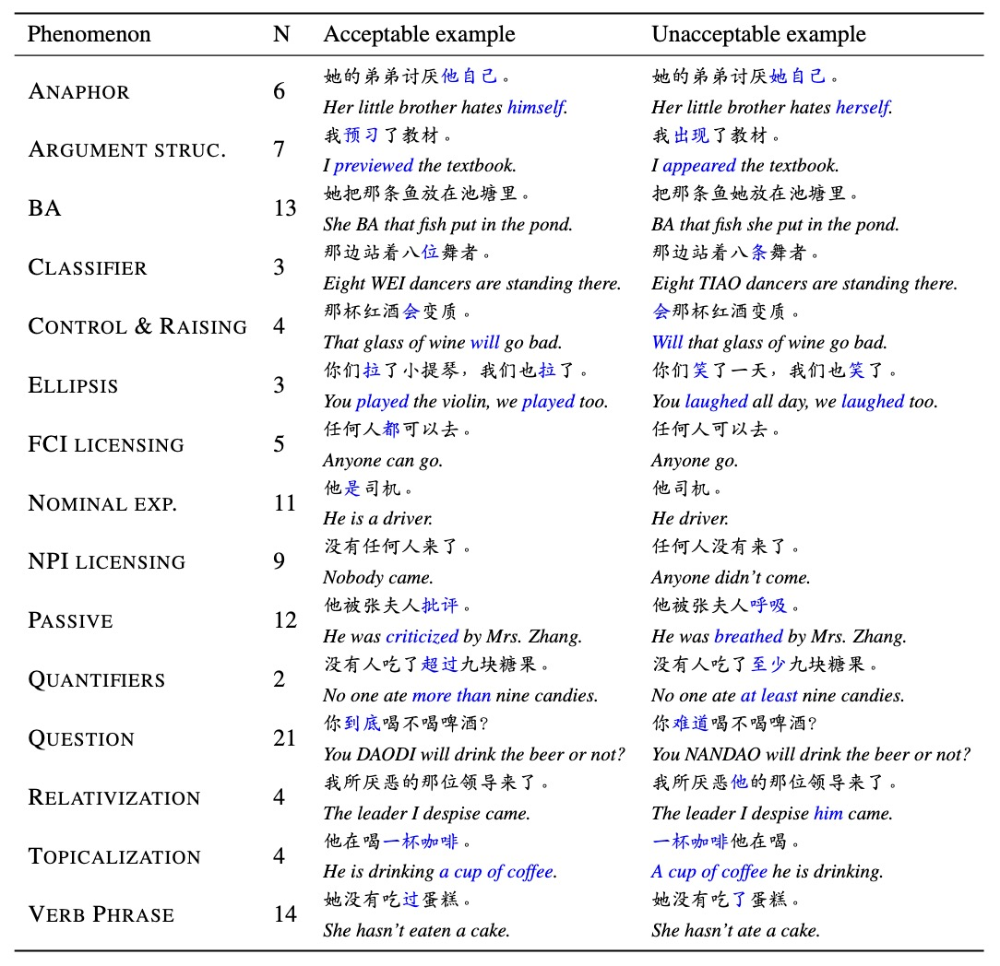

# ZhoBLiMP: a Systematic Assessment of Language Models with Linguistic Minimal Pairs in Chinese

<div align="center">
Yikang Liu, Yeting Shen, Hongao Zhu, Lilong Xu, Zhiheng Qian, Siyuan Song, Kejia Zhang <br>
Jialong Tang, Pei Zhang, Baosong Yang, Rui Wang, Hai Hu

_Shanghai Jiao Tong University & Tongyi Lab, Alibaba Cloud_

<sup>If you have any questions, please contact [Yikang Liu](https://yikang0131.github.io/) and [Hai Hu](https://huhailinguist.github.io/).</sup>

📝 [**Paper**](https://arxiv.org/pdf/2411.06096) 🤗 [**Models**](https://huggingface.co/collections/SJTU-CL/zh-pythia-6734b40c21823ee4ea28de8f)

</div>

ZhoBLiMP is a dataset that can be used to probe Chinese linguistic knowledge in language models, especially syntax. It contains 35k minimal pairs that differ in a minimal way to demonstrate a single syntactic or semantic contrast. ZhoBLiMP has 118 paradigms in 15 high-level linguistic phenemena.

<div align="center">

</div>

We evaluate several off-the-shelf LLMs and Pythina-based models we train from scratch on ZhoBLiMP.
Our results show that model performance saturates with limited model parameters (around 500M) and training data (around 1B tokens).

<div align="center">

</div>

Along with the dataset, we release model checkpoints we train from scratch and code for the web interface for minimal pair generation.

## Data generation interface

The ZhoBLiMP dataset is available in the file `ZhoBLiMP.tar.gz`. The dataset is generated by the following steps:

- We annotate lexicons with linguistic properties to make a vocabulary for generation (see `assets/vocab.tsv`).
- We craft grammar templates for each linguistic paradigm. Each paradigm is a json file (see `projects/ZhoBLiMP`).
- We generate minimal pairs by filling in the templates with the vocabulary through the module named `data_gen`.

You can try the following command to generate the dataset:

```bash
python -m data_gen -I projects/ZhoBLiMP -O ZhoBLiMP
```

You can also launch the web interface to add or modify the templates, or start your own new project (please refer to the docs in `frontend` for the grammar of crafting templates).

```bash
cd frontend
python app.py
```

You can check the following demo video for the web interface:


https://github.com/user-attachments/assets/a8be2aa2-c3ed-468c-9a81-08e8d63cd6ba


## Model download and evaluation

You can download the model checkpoints used in our paper from the Hugging Face model hub.

```bash
huggingface-cli download SJTU-CL/Zh-Pythia-1.4B --local-dir path/to/save --local-dir-use-symlinks False
```

And then you can evaluate the model or any other open-sourced ones in Hugging Face on the ZhoBLiMP dataset by running the following command:

```bash
tar zxvf ZhoBLiMP.tar.gz
python eval.py -M path/to/model -D ZhoBLiMP -O path/to/output -B 64
```
